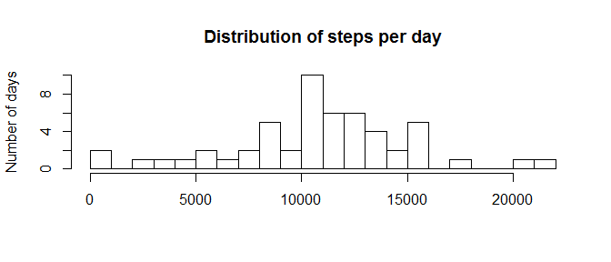
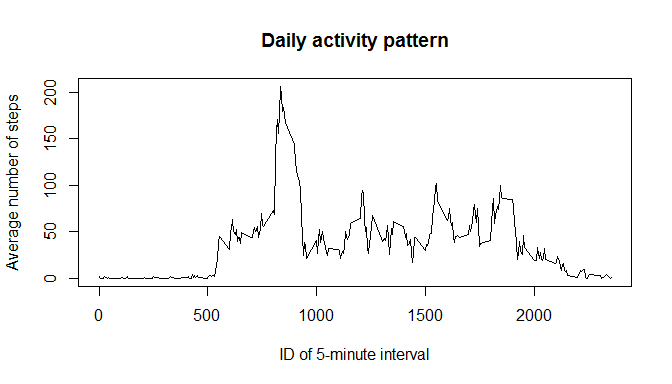
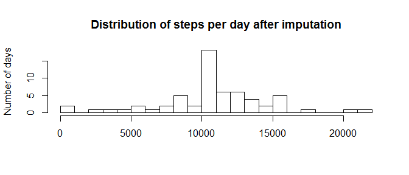
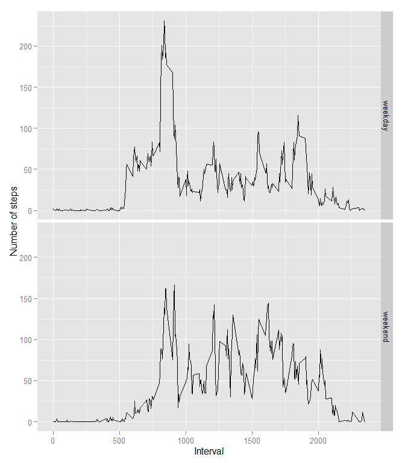

# Reproducible Research: Peer Assessment 1


## Loading and preprocessing the data

Fork/Clone the repository and set the working directory to the cloned folder

```r
setwd("~/Coursera/Reproducible Research/PeerAssessment1/RepData_PeerAssessment1")
cn <- unz(description="activity.zip", filename="activity.csv")
act_data <- read.csv(cn)
act_data$date <- as.Date(act_data$date)
```

## What is mean total number of steps taken per day?


```r
library(dplyr)
```

```
## 
## Attaching package: 'dplyr'
## 
## Следующие объекты скрыты от 'package:stats':
## 
##     filter, lag
## 
## Следующие объекты скрыты от 'package:base':
## 
##     intersect, setdiff, setequal, union
```


```r
steps_day <- summarise(group_by(act_data, date), ttl_steps=sum(steps))
```


```r
hist(steps_day$ttl_steps, breaks=25, main="Distribution of steps per day", xlab=NULL, ylab="Number of days")
```

 


```r
mn <- mean(steps_day$ttl_steps, na.rm=TRUE)
md <- median(steps_day$ttl_steps, na.rm=TRUE)
```

The mean and median of the total number of steps taken per day is 10766.19 and 10765 respectively.

## What is the average daily activity pattern?


```r
day_pat <- summarise(group_by(act_data, interval), avg_steps=mean(steps, na.rm=TRUE))
```


```r
with(day_pat, plot(interval, avg_steps, type="l", main="Daily activity pattern", xlab="ID of 5-minute interval", ylab="Average number of steps"))
```

 


```r
mx_int <- day_pat$interval[which.max(day_pat$avg_steps)]
```

The 5-minute interval with ID = 835 contains the maximum number of steps on average across all the days in the dataset.

## Imputing missing values


```r
mv_num <- sum(is.na(act_data$steps))
```

The total number of missing values in the dataset is 2304.


```r
act_data_impd <- act_data
act_data_impd$steps[which(is.na(act_data_impd$steps))] <- day_pat$avg_steps[which(day_pat$interval %in% act_data_impd$interval[which(is.na(act_data_impd$steps))])]
```


```r
steps_day_impd <- summarise(group_by(act_data_impd, date), ttl_steps=sum(steps))
```


```r
hist(steps_day_impd$ttl_steps, breaks=25, main="Distribution of steps per day after imputation", xlab=NULL, ylab="Number of days")
```

 


```r
mn_impd <- mean(steps_day_impd$ttl_steps, na.rm=TRUE)
md_impd <- median(steps_day_impd$ttl_steps, na.rm=TRUE)
```

The mean and median of the total number of steps taken per day is 10766.19 and 10766.19 respectively.
Median has changed after imputation.

## Are there differences in activity patterns between weekdays and weekends?


```r
act_data_impd$wkday <- factor(weekdays(act_data_impd$date, abbreviate = TRUE) %in% c("Сб", "Вс"), ordered=TRUE)
levels(act_data_impd$wkday) <- c("weekday", "weekend")
day_pat2 <- summarise(group_by(act_data_impd, interval, wkday), avg_steps=mean(steps, na.rm=TRUE))

library(ggplot2)
```


```r
qplot(interval, avg_steps, data = day_pat2, facets = wkday ~ .,
          xlab="Interval",
          ylab="Number of steps", geom = "line")
```

 


```r
sessionInfo()
```

```
## R version 3.2.2 (2015-08-14)
## Platform: x86_64-w64-mingw32/x64 (64-bit)
## Running under: Windows 8 x64 (build 9200)
## 
## locale:
## [1] LC_COLLATE=Russian_Russia.1251  LC_CTYPE=Russian_Russia.1251   
## [3] LC_MONETARY=Russian_Russia.1251 LC_NUMERIC=C                   
## [5] LC_TIME=Russian_Russia.1251    
## 
## attached base packages:
## [1] stats     graphics  grDevices utils     datasets  methods   base     
## 
## other attached packages:
## [1] ggplot2_1.0.1 dplyr_0.4.3  
## 
## loaded via a namespace (and not attached):
##  [1] Rcpp_0.12.1      knitr_1.11       magrittr_1.5     MASS_7.3-43     
##  [5] munsell_0.4.2    colorspace_1.2-6 R6_2.1.1         stringr_1.0.0   
##  [9] plyr_1.8.3       tools_3.2.2      parallel_3.2.2   grid_3.2.2      
## [13] gtable_0.1.2     DBI_0.3.1        htmltools_0.2.6  yaml_2.1.13     
## [17] lazyeval_0.1.10  assertthat_0.1   digest_0.6.8     reshape2_1.4.1  
## [21] formatR_1.2.1    evaluate_0.8     rmarkdown_0.8.1  labeling_0.3    
## [25] stringi_0.5-5    scales_0.3.0     proto_0.3-10
```
